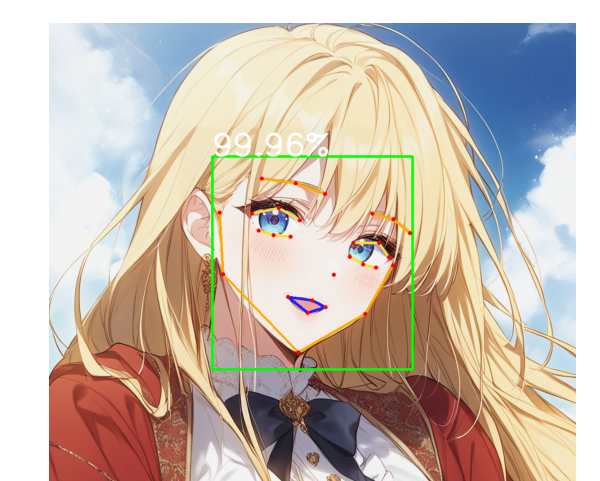

# Prerequisite

[](https://developer.nvidia.com/cuda-11-4-0-download-archive?target_os=Windows&target_arch=x86_64&target_version=10&target_type=exe_local)


This repository is based on [anime-face-detector](https://github.com/hysts/anime-face-detector)




<br/>

## Installation

```bash
pip install torch==1.12.1+cu113 torchvision==0.13.1+cu113 torchaudio==0.12.1 --extra-index-url https://download.pytorch.org/whl/cu113
pip install openmim
pip install mmcv-full==1.6.2 -f https://download.openmmlab.com/mmcv/dist/cu113/torch1.12/index.html
pip install mmdet==2.28.2
pip install mmpose==0.29.0
pip install numpy==1.23.5
```

This package is tested on Windows.
