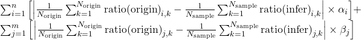
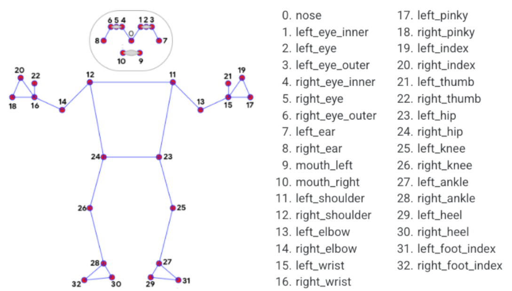

# LoRA evaluator

[](https://developer.nvidia.com/cuda-11-4-0-download-archive?target_os=Windows&target_arch=x86_64&target_version=10&target_type=exe_local)
[](https://pytorch.org/get-started/previous-versions/)<br/><br/>
[](https://mmcv.readthedocs.io/en/v1.6.2/get_started/installation.html)
[](https://github.com/open-mmlab/mmdetection)
[](https://github.com/open-mmlab/mmpose)

Lora-Evaluator is a powerful tool designed to combine anime face detection and body detection to analyze how similar a character is to its original form after model training.

Facial detection is based on [anime-face-detector](https://github.com/hysts/anime-face-detector) repository and provides face analysis to ensure precise similarity detection.


<br/>

## Evaluate function

This library enables visual analysis to determine which LoRA step achieved better training results.

The **evaluation function** is defined as follows:

<br/>



<br/>

- $i$ represents the metrics for the body, while $j$ represents the metrics for the face.
- The weights $α_i$ and $β_j$ are chosen based on the optimal balance as perceived by the user.
- $k$ denotes the index of each image in the dataset and is used to calculate the difference between the original and inferred ratios for each image.
- $N$ represents the total number of images used in calculating the average difference between the original and inferred ratios. Note that the number of images for the sample and the original datasets may differ, and each average is calculated separately for them.

<br/>
Among the various LoRA steps, we will consider the step with the minimum value of this formula as the most optimal LoRA.

<br/>

## Landmarks metric
In our analysis, we consider the following key ratios of **facial** and **body landmarks**. These metrics help to assess proportions and spatial relationships between various points on the face and body, providing insights into symmetry and structural balance.

<br/>

**1. Body Metrics**



<br/>

The body metrics focus on the proportions between different body parts, particularly the shoulder and waist width.

(1) Shoulder Width [12-11] : Waist Width [24-23]

<br/><br/>

**2. Facial Metrics**


<br/>

The face metrics are defined in relation to face width or face height.

(1) Outer Canthal Distance (OCD) [11-19] : Face Width [0-4]

(2) Inner Canthal Distance (ICD) [13-17] : Face Width [0-4]

(3) Eye to Nose Distance [avg(12-23, 18-23)] : Face Height [midpoint of 7 and 8 - 2]

(4) Nose to Mouth Distance [23-25] : Face Height [midpoint of 7 and 8 - 2]

(5) Chin Length [23-2] : Face Height [midpoint of 7 and 8 - 2]

(6) Eyebrow Height [avg(6-12, 9-18)] : Face Height [midpoint of 7 and 8 - 2]

<br/>

## Optimal Weights for Similarity Ratios

The optimal values of $α_i$ and $β_j$, determined experimentally for assessing similarity, are as follows:

| Parts | Ratio                  | Weight | 
|-------|------------------------|--------|
| Body  | Shoulder To Waist      | 0.25   |
| Face  | Outer Canthal Distance | 0.1    |
| Face  | Inner Canthal Ratio    | 0.1    |
| Face  | Eye To Nose Ratio      | 0.15   |
| Face  | Nose To Mouth Ratio    | 0.1    |
| Face  | Chin Length Ratio      | 0.2    |
| Face  | Eyebrow Height Ratio   | 0.1    |

<br/>

## Use Case
```bash
step_10475.csv:
  Shoulder To Waist: Weighted Score = 1.2105
  Outer Canthal Distance: Weighted Score = 1.8304
  Inner Canthal Ratio: Weighted Score = 0.7941
  Eye To Nose Ratio: Weighted Score = 0.0182
  Nose To Mouth Ratio: Weighted Score = 2.7471
  Chin Length Ratio: Weighted Score = 0.3803
  Eyebrow Height Ratio: Weighted Score = 1.8168
  Total Weighted Score = 8.7974

step_850.csv:
  Shoulder To Waist: Weighted Score = 0.8933
  Outer Canthal Distance: Weighted Score = 1.3455
  Inner Canthal Ratio: Weighted Score = 1.1175
  Eye To Nose Ratio: Weighted Score = 0.0815
  Nose To Mouth Ratio: Weighted Score = 2.2953
  Chin Length Ratio: Weighted Score = 0.6899
  Eyebrow Height Ratio: Weighted Score = 1.6224
  Total Weighted Score = 8.0454

Best CSV File: 850.csv with Score: 8.0454
```

## Installation
To get started with the tool, install the necessary libraries with the following commands:
```bash
pip install torch==1.12.1+cu113 torchvision==0.13.1+cu113 torchaudio==0.12.1 --extra-index-url https://download.pytorch.org/whl/cu113
pip install openmim
pip install mmcv-full==1.6.2 -f https://download.openmmlab.com/mmcv/dist/cu113/torch1.12/index.html
pip install mmdet==2.28.2
pip install mmpose==0.29.0
pip install numpy==1.23.5
pip install mediapipe
pip install anime_face_detector
```

⚙️ This package has been tested on Windows.
