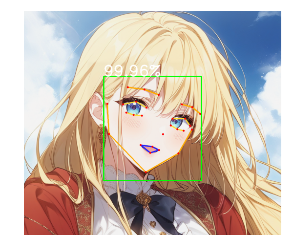
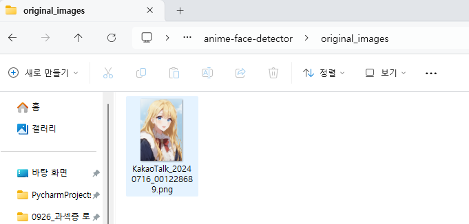
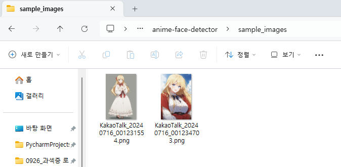
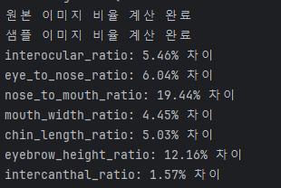

## [ 참고 논문 및 참고 문헌 ]
 1. comfyui 라이브러리
엔진의 백엔드 서버의 뼈대로 사용되는 툴

https://github.com/comfyanonymous/ComfyUI

 2. dreambooth & lora

훈련에 사용되는 기초 방법론들(dreambooth 에 비해 lora-based가 연산 측면에서 훨씬 효율적)

https://arxiv.org/abs/2208.12242

https://github.com/cloneofsimo/lora

https://arxiv.org/abs/2403.14572

 3. 훈련에 사용되는 라이브러리

https://github.com/bmaltais/kohya_ss

 4. 텐서보드 & wandb
양질의 훈련 상황 체크를 위한 도구

https://www.tensorflow.org/tensorboard?hl=ko

https://kr.wandb.ai/

 5. 고유 웹툰 캐릭터 & 데이터 등은 flexenm 자산

 6. 기존 comfyui 활용한 타 사이트 사례(비교, nsfw 컨텐츠 포함)

https://pixai.art/

https://www.soulgen.ai/create

https://promptchan.ai/ai-porn

https://www.seduced.ai/?ref=64c8f04cbe3697f496bf3b9f

https://candy.ai/?via=mspu&fp_sid=mspoweruser.com/7-ai-art-generators-that-allow-nsfw-images/?language=ko

https://playground.com/feed

   

## [ 일관성 검증 도구 ]
훈련이 잘된 여러 후보군 지점에 대해, 인간의 눈으로 한 번 더 보고 판별하는게 일반적입니다.

(후보군은 loss 값을 기준으로 산정되었으나, 모델의 출력이 시각화되어 보여지는 stable diffsion 의 특성상 다른 검증 도구의 필요성을 느꼈습니다.)

-> 이를 위한 새로운 검증 도구 개발 중입니다. (해당 내용도 특허 등록이 가능한지 여쭙고자 합니다.)

-> 얼굴의 주요 부위 및 신체 주요 골격 등을 토대로 landmark를 잡아 비율을 측정합니다.

훈련전 원본 데이터셋들의 주요 부위 비율(미간, 눈코, 코입, 입 너비 등 ...)의 평균값과 훈련 완료된 가중치로부터 추출된 샘플 이미지들의 평가 지표의 평균값들을 내어 오차율로 판단합니다.

활용 라이브러리

https://github.com/hysts/anime-face-detector

