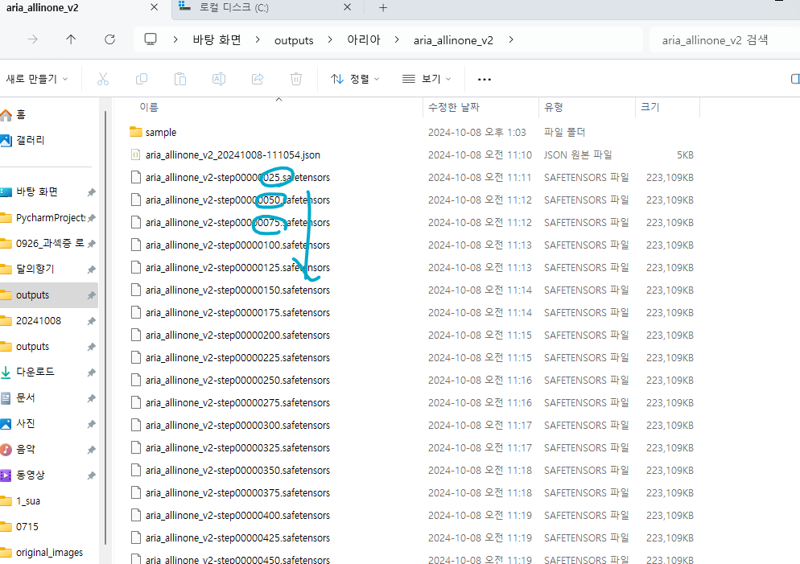
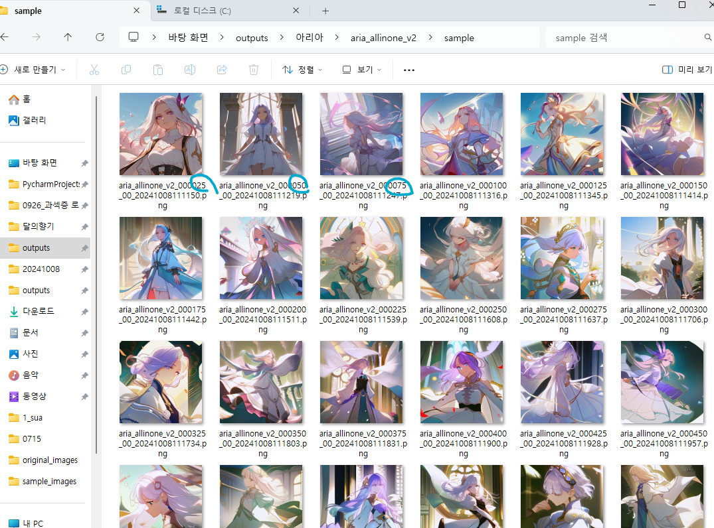
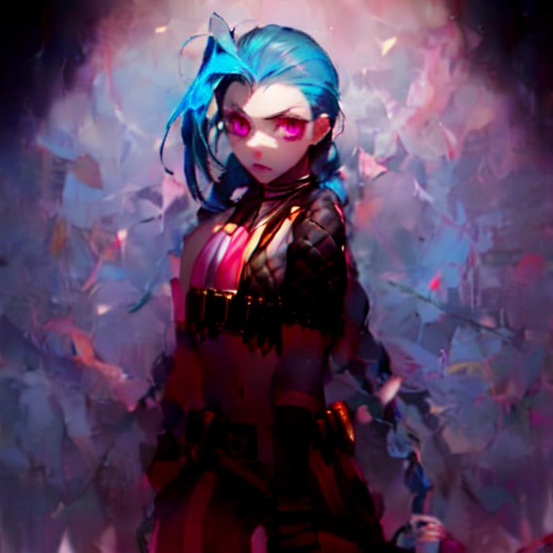
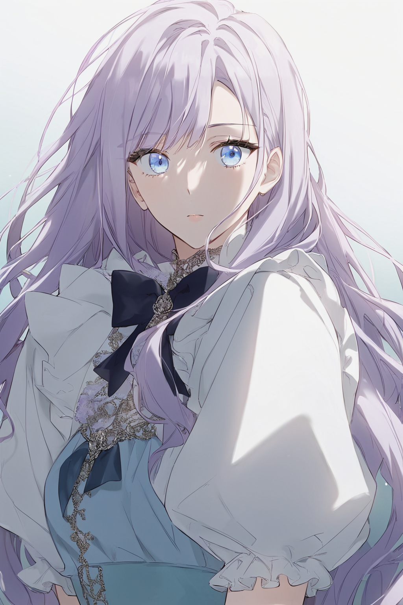
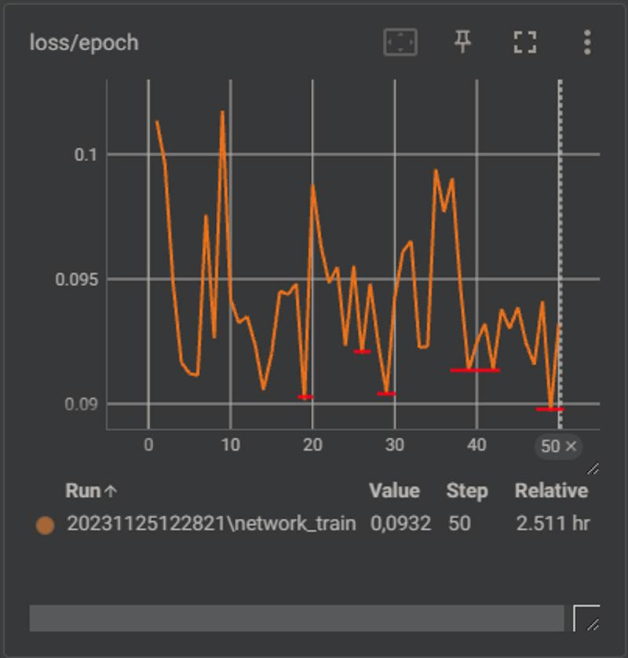
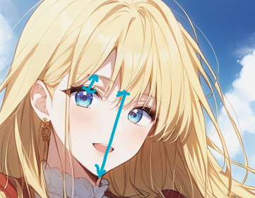
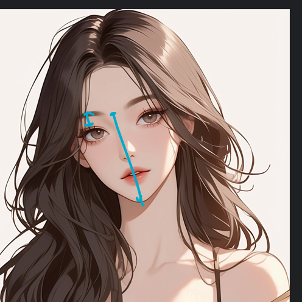

## [ 캐릭터 일관성 유지에 관한 객관적 검증 도구 ]

일반론적인 LORA를 이용한 학습법 및 가중치 선별법에 대해 먼저 간략히 설명드리겠습니다.

[그림 1]과 같이 step 이 지남에 따라, 점차 학습되면서 각 step 의 가중치에 대해 뽑은 샘플 이미지가 점점 원본 데이터에 가까워지는 것을 확인할 수 있습니다.

[그림 1] 실제 생성에 사용되는 학습 가중치

[그림 2] 각 가중치별 생성된 샘플 이미지

하지만, 너무 학습을 오래 진행하다보면 overfitting 현상의 발생으로 인한 '이미지 쪼개짐 현상'이 발생하게 됩니다.

[그림 3] overfitting 으로 인한 이미지 쪼개짐 현상 예시

반대로, 학습이 underfitting 된다면 원본 데이터의 묘사를 제대로 하지 못하는 현상이 발생합니다.

[그림 4] 훈련에 사용된 원본 이미지

[그림 5] underfitting 현상 예시

따라서, 일반적으로는 [ 그림 6 ] 같이 loss 값이 적은 step(≈epoch) 의 여러 극소점들에 대해 샘플을 테스트하여, 인간의 시각에 기반하여 경험론적으로 판단하는 것이 일반론적입니다.

[그림 6] step - loss graph

하지만, 이 과정에서 많은 인적 노고가 발생합니다. loss graph 를 보고, 학습 샘플을 보고, 가중치를 선별하여 다른 응용 이미지에 대해 출력해보는 과정을 거쳐 최적의 가중치를 선별하기 때문입니다.

또한, 해당 방법은 사람의 눈에만 의존하기 때문에 객관적이지 않으며, 평가자인 사람마다 다르게 평가 및 판단될 수 있습니다.

따라서, 새로운 객관적인 수치학적 검증 방법에 대한 아이디어를 구상해보았습니다. 신체 및 얼굴의 주요 부위나 지점(landmark)을 tracking 하는 도구를 활용하여, 이미지 속 캐릭터의 각 주요 신체 지점별 비율을 계산합니다.

[그림 7] 눈<->눈썹 대비 얼굴 길이 비율 예시 이미지 1

[그림 8] 눈<->눈썹 대비 얼굴 길이 비율 예시 이미지 1

그 예시로, [그림 7] 과 [그림 8] 에서 나타난 캐릭터 얼굴의 비율을 비교해보면, 아래 이미지가 상대적으로 더 큰 비율을 세로 길이 비율을 갖고 있습니다.

이를 유클리디안 거리로 비율을 계산하고, 여러 신체 및 얼굴의 주요 부위를 고려합니다. 이를 통해 수치적인 오차가 적을 수록 원본 이미지에 대해 학습이 잘된 캐릭터라고 판단하며, 이는 인간의 눈이 아닌 머신러닝 기법으로 자동화 될 수 있다는 것이 이 검증 도구의 핵심 아이디어입니다.

   
참고 자료

https://civitai.com/articles/3105/essential-to-advanced-guide-to-training-a-lora

